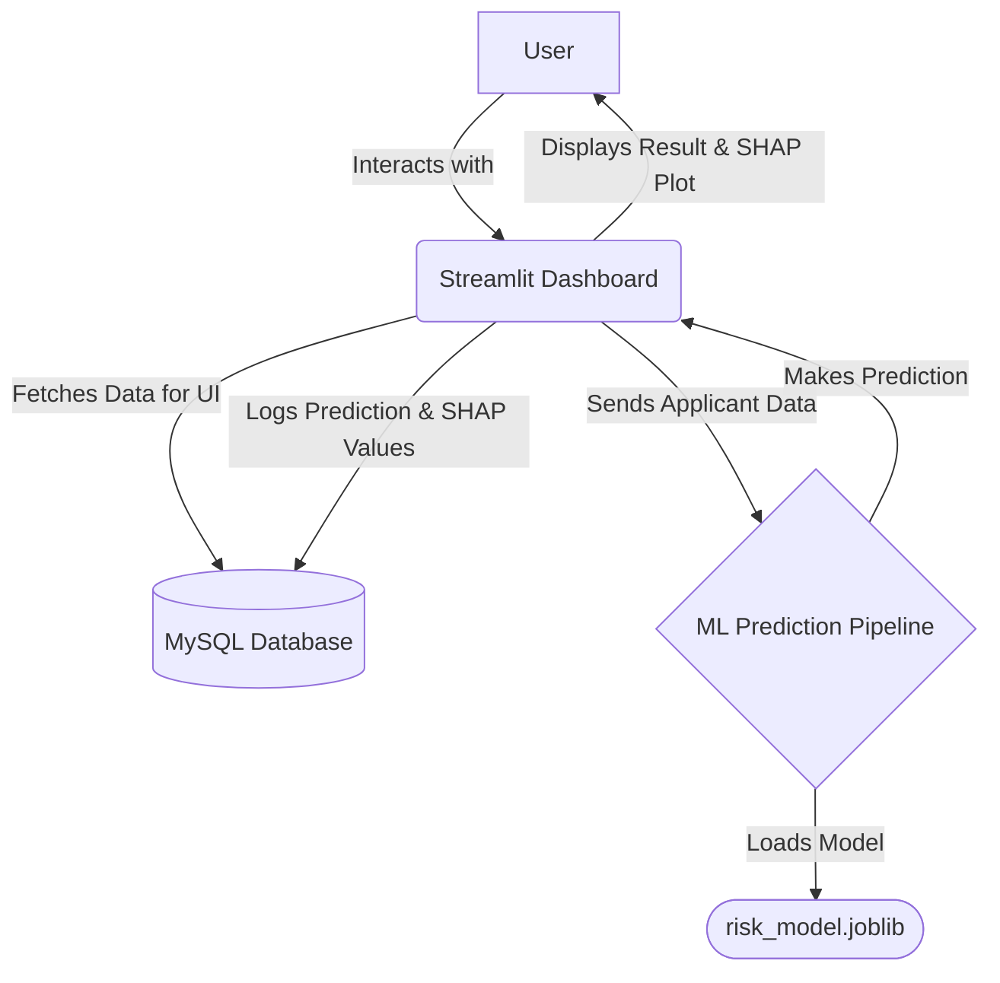
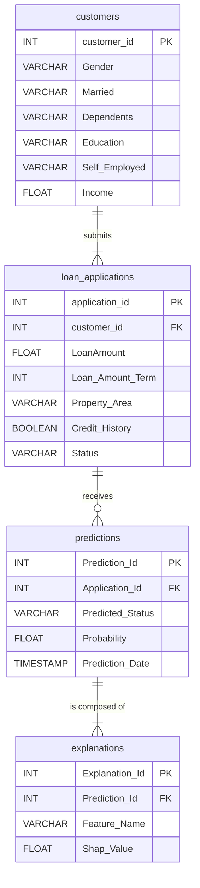

# 🏦 Credit Risk Prediction System with MLOps & Explainable AI

This project is an end-to-end machine learning application designed to predict credit risk for loan applications. It integrates a powerful XGBoost model with a full database backend and an interactive web dashboard built with Streamlit, demonstrating a full MLOps cycle from data loading to prediction, explanation, and monitoring.

---
## ✨ Key Features

* **Multi-Page Web Dashboard**: An interactive and user-friendly interface built with Streamlit for data exploration, prediction, and monitoring.
* **High-Accuracy ML Model**: Utilizes an **XGBoost** classifier, trained on historical loan data, for robust and reliable predictions.
* **Full Database Integration**: A **MySQL** database backend stores all customer data, loan applications, predictions, and model explanations, making the system persistent and scalable.
* **Explainable AI (XAI)**:
    * **Local Explanations**: Generates **SHAP force plots** for every prediction, showing exactly which features contributed to the loan approval or rejection decision.
    * **Global Explanations**: Features a dedicated dashboard page to analyze all historical SHAP values stored in the database, revealing the most influential features for the model's behavior over time.
* **Prediction Monitoring**: A "Prediction History" dashboard page queries the database to display key metrics, prediction distributions, and a log of the most recent decisions made by the model.
* **Automated Data Loading**: A script is provided to automatically migrate the initial dataset from a CSV file into the normalized relational database schema.

---
## 🛠️ Tech Stack

* **Backend & ML**: Python, Pandas, NumPy, Scikit-learn
* **Machine Learning Model**: XGBoost
* **Explainability**: SHAP
* **Web Framework**: Streamlit
* **Database**: MySQL
* **DB Connector**: SQLAlchemy, PyMySQL
* **Plotting**: Plotly, Matplotlib

---
## 📈 Model Performance

The XGBoost model was evaluated on the test set to assess its performance in predicting loan approval status. The model demonstrates strong predictive power with an overall accuracy of 84%.

**Classification Report:**

| | Precision | Recall | F1-Score | Support |
| :--- | :--- | :--- | :--- | :--- |
| **0 (Rejected)** | 0.95 | 0.55 | 0.70 | 38 |
| **1 (Approved)** | 0.80 | 0.98 | 0.88 | 85 |
| | | | | |
| **Accuracy** | | | **0.84** | 123 |
| **Macro Avg** | 0.88 | 0.77 | 0.79 | 123 |
| **Weighted Avg** | 0.85 | 0.84 | 0.82 | 123 |

### Key Observations:
* **High Accuracy**: The model achieves an **overall accuracy of 84%**, correctly classifying the majority of loan applications in the test set.
* **Excellent Recall for Approvals**: The model excels at identifying applicants who should be approved, with a **recall of 0.98** for the "Approved" class (1). This is crucial for a bank, as it means the model rarely misses a qualified applicant.
* **Strong Precision for Rejections**: When the model predicts a rejection, it is correct **95% of the time** (precision of 0.95 for the "Rejected" class). This minimizes the risk of rejecting creditworthy applicants incorrectly.

---
## 🏗️ System Architecture

The application follows a simple but powerful architecture where the Streamlit frontend communicates with the ML model and the MySQL database.



---
## 🗂️ Database Schema (ERD)

The database is designed with four normalized tables to efficiently store all relevant information.


## 🚀 Getting Started

Follow these steps to set up and run the project on your local machine.

### 1. Prerequisites
* Git
* Python (version 3.10 or 3.11 recommended)
* A running MySQL Server instance on your local machine.

### 2. Setup Instructions

**Clone the repository:**
```bash
git clone [https://github.com/Mayurdoiphode55/Credit_Risk_Prediction_Project.git](https://github.com/Mayurdoiphode55/Credit_Risk_Prediction_Project.git)
cd Credit_Risk_Prediction_Project
```

**Create and activate the virtual environment:**
```bash
# Create the virtual environment
python -m venv credit_risk_env
```
```bash
# Activate the environment (choose the command for your shell)

# Windows (PowerShell):
.\credit_risk_env\Scripts\Activate.ps1

# Windows (Command Prompt):
.\credit_risk_env\Scripts\activate.bat

# macOS / Linux:
source credit_risk_env/bin/activate
```

**Install the required packages:**
```bash
pip install -r requirements.txt
```

**Set up the database:**
1.  Make sure your MySQL server is running.
2.  Create a new database named `credit_risk_db`.
3.  Update the password in `DB_CONFIG` in both `dashboard.py` and `load_data_to_db.py` if yours is different.
4.  Run the data loading script to create the tables and populate them with the initial dataset:
    ```bash
    python load_data_to_db.py
    ```

### 3. Running the Application

Once the setup is complete, run the Streamlit application from your terminal:
```bash
streamlit run dashboard.py
```
A new tab should open in your web browser with the dashboard running!

---
## 📜 License

This project is licensed under the MIT License - see the [LICENSE](LICENSE) file for details.
