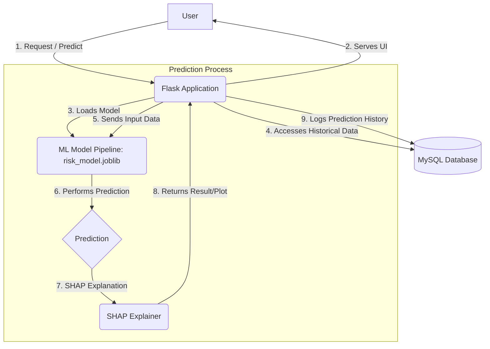
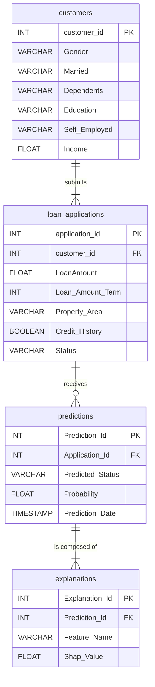

# 🏦 Credit Risk Prediction System with MLOps & Explainable AI (Flask + MySQL)

This project is an end-to-end machine learning application designed to predict credit risk for loan applications. It integrates a powerful ML model with a full database backend and an interactive **RESTful API and web dashboard built with Flask**, demonstrating a full MLOps cycle from data loading to prediction, explanation, and monitoring.

---

## ✨ Key Features

* **RESTful API & Web Dashboard**: A lightweight, high-performance web application built with **Flask**, serving both a dynamic HTML dashboard (using Jinja templates) and a set of **REST APIs** for predictions and data retrieval.
* **High-Accuracy ML Model**: Utilizes an **XGBoost** classifier, trained on historical loan data, for robust and reliable predictions.
* **Full Database Integration**: A **MySQL** database backend stores all customer data, loan applications, predictions, and model explanations, making the system persistent and scalable.
* **Explainable AI (XAI)**:
  * **Local Explanations**: Generates **SHAP force plots** for every prediction, showing which features influenced the loan decision.
  * **Global Explanations**: Displays feature importance trends across historical predictions.
* **Prediction Monitoring**: Includes a dashboard that tracks prediction trends, accuracy, and loan decision metrics.
* **Automated Data Loading**: A script (`load_data_to_db.py`) automatically migrates data from CSV into MySQL.

---

## 🛠️ Tech Stack

| Category | Tools Used |
| :--- | :--- |
| **Web & API** | Flask, Jinja2, RESTful APIs |
| **Backend & ML** | Python, Pandas, NumPy, Scikit-learn |
| **ML Model** | XGBoost |
| **Explainability** | SHAP |
| **Database** | MySQL |
| **DB Connector** | SQLAlchemy, PyMySQL |
| **Plotting** | Plotly |

---

## 📈 Model Performance

The XGBoost model was evaluated on the test set and demonstrates strong predictive power with an overall accuracy of **84%**.

| | Precision | Recall | F1-Score | Support |
| :--- | :---: | :---: | :---: | :---: |
| **0 (Rejected)** | 0.95 | 0.55 | 0.70 | 38 |
| **1 (Approved)** | 0.80 | 0.98 | 0.88 | 85 |
| **Accuracy** |  |  | **0.84** | 123 |

### Observations:
- **High Accuracy**: 84% overall accuracy  
- **High Recall (Approved class)**: 0.98 recall ensures minimal missed loan approvals  
- **Strong Precision (Rejected class)**: 0.95 precision reduces false rejections  

---

## 🏗️ System Architecture

The system uses a three-tier design where Flask handles the UI, API, and business logic, interacting directly with the ML model and MySQL database.



---
## 🗂️ Database Schema (ERD)

The database is designed with four normalized tables to efficiently store all relevant information.




## 🚀 Getting Started

Follow these steps to set up and run the project on your local machine.

### 1. Prerequisites
* Git
* Python (version 3.10 or 3.11 recommended)
* A running MySQL Server instance on your local machine.

### 2. Setup Instructions

**Clone the repository:**
```bash
git clone [https://github.com/Mayurdoiphode55/Credit_Risk_Prediction_Project.git](https://github.com/Mayurdoiphode55/Credit_Risk_Prediction_Project.git)
cd Credit_Risk_Prediction_Project
```

**Create and activate the virtual environment:**
```bash
# Create the virtual environment
python -m venv credit_risk_env
```
```bash
# Activate the environment (choose the command for your shell)

# Windows (PowerShell):
.\credit_risk_env\Scripts\Activate.ps1

# Windows (Command Prompt):
.\credit_risk_env\Scripts\activate.bat

# macOS / Linux:
source credit_risk_env/bin/activate
```

**Install the required packages:**
```bash
pip install -r requirements.txt
```

**Set up the database:**
1.  Make sure your MySQL server is running.
2.  Create a new database named `credit_risk_db`.
3.  Update the password in `DB_CONFIG` in both `app.py` and `load_data_to_db.py` if yours is different.
4.  Run the data loading script to create the tables and populate them with the initial dataset:
    ```bash
    python load_data_to_db.py
    ```

### 3. Running the Application

After setup, start the Flask server:
```bash
set FLASK_APP=app.py
```

```bash
flask run
```
Then open your browser and visit:
👉 http://127.0.0.1:5000

---
## 📜 License

This project is licensed under the MIT License - see the [LICENSE](LICENSE) file for details.
